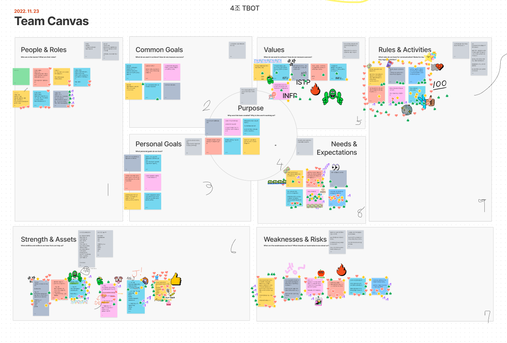
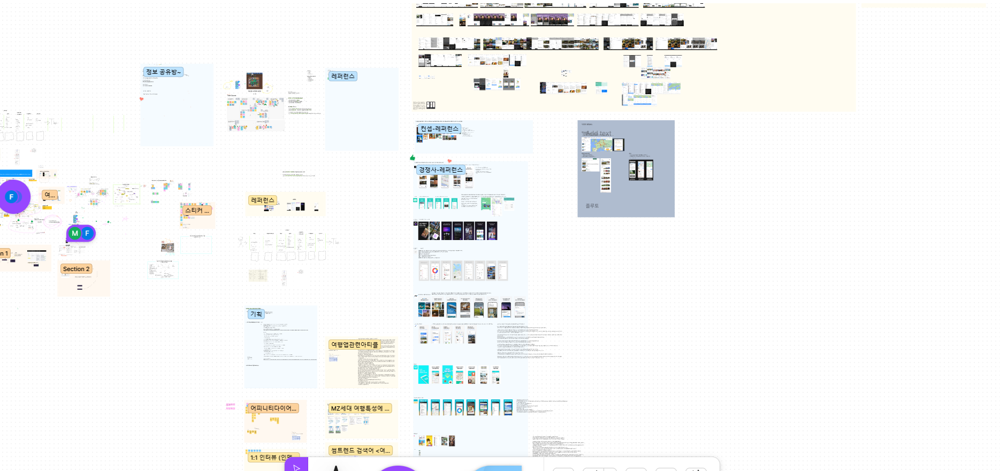
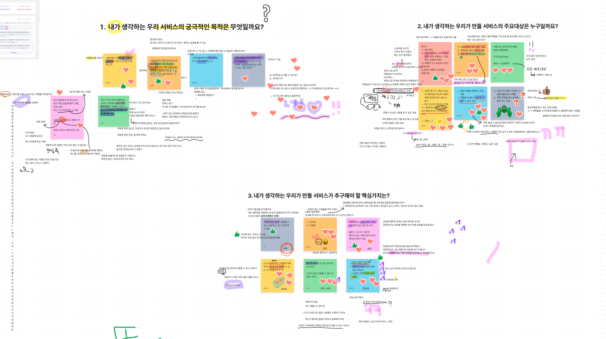
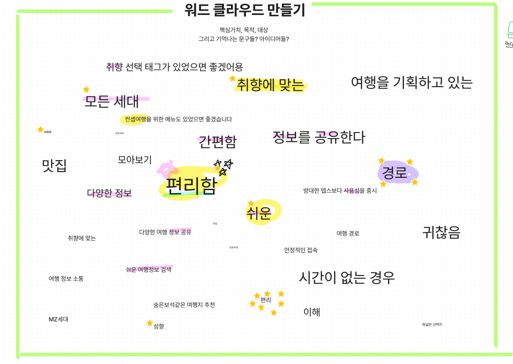
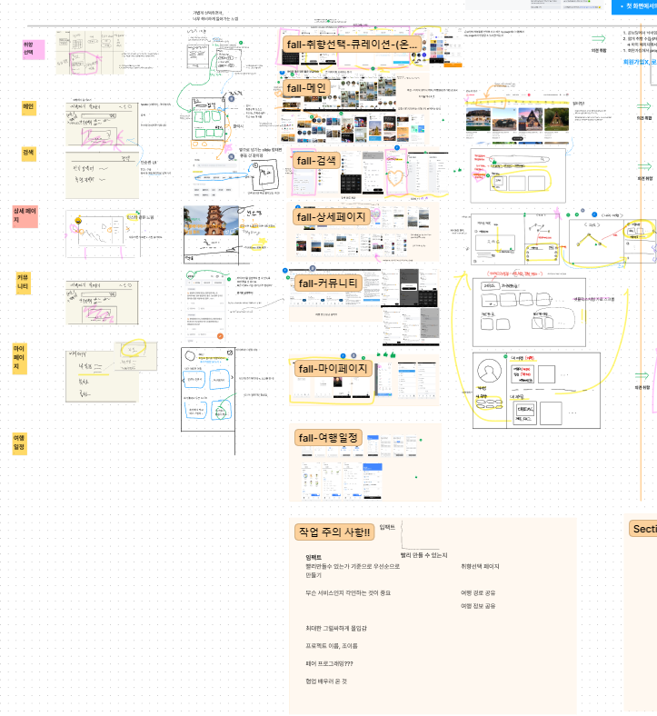
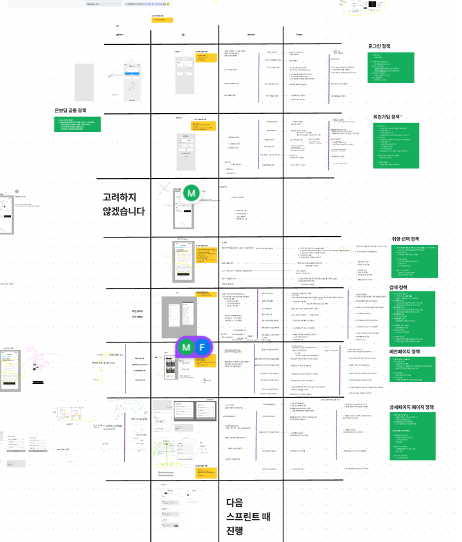
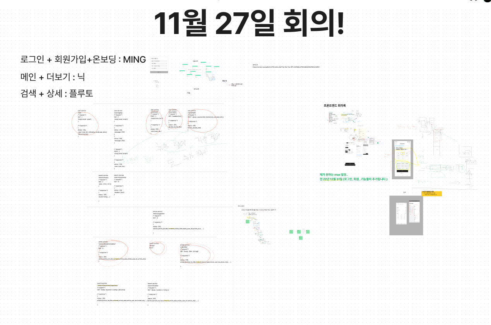

# Trip And You

** 우리는 불4조 Trip And You 입니다.

## 서비스의 목적 
** 여행을 계획하거나 내 주변의 여행지를 찾는 모든 사람들이 취향에 맞게 쉽게 여행을 계획하고 찾아갈 수 있는 서비스입니다.
    
## 서비스 기회 배경

코로나도 끝나고 여행 가려고 알아보고 찾는데  
각자 블로그에 올리는 게 대부분이라   
모아보고 각각의 사용자가 올린 일정에 따라 기획하고   
여행이 쉽고 효율적이었으면   
그런 서비스 없을까?     

## 우리의 고민   
1. 그 많은 여행 서비스가 있는데 왜 사용되지 않을까?  
2. 어떻하면 사용자가 쉽고 편하게 우리의 서비스를 이용하게 될까?   
3. 우리의 서비스 이용 대상은 누구일까?     

## 우리의 해결 및 방향성
<ul>
  <li>
  <ul>
  우리의 고객 
  <li>여행을 계획하는 여행 입문자 </li>
  <li>내 주변의 여행지를 찾는 사람 </li>
  </ul>
  </li>
   <li>
  <ul>
  우리의 재공 서비스 
  <li>취향별 , 지역별 여행다녀온 분들의 리뷰  </li>
  <li>모아논 여행지를 분류별로 담아 언제든 꺼내보기 </li>
  </ul>
  </li>
</ul>

## 사용기술
<h4>프론트엔드</h4>
<ul>
  <li>
    프레임워크 : 리액트
  </li>
  <li>
    언어 : 타입스트립트
  </li>
  <li>
    상태관리 : Recoil
  </li>
  <li>
    css : Tailwind
  </li>
  <li>
    패포 : netflix
  </li>
  <li>
    yarn
  </li>
 </ul>
 <h4>백엔드</h4>
<ul>
  <li>
    프레임워크 : 스프링
  </li>
  <li>
    언어 : 자바
  </li>
  <li>
    DB : Mysql
  </li>
  <li>
    패포 : AWS(EC2, RDS)
  </li>
 </ul>
 

## 우리들의 여정
 <h3>13기 시작</h3>
 
  <h3>첫째날</h3>
 
  <h4>프로젝트에 진심이었던 우리 디자이너</h4>
 
   <h3>둘째날</h3>
 
 
 
He is Gon ㅠㅠ

  <h3>셋째날</h3>
 
  <h3>넷째날</h3>
 
   <h3>다섯째날</h3>
 